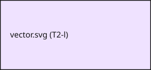
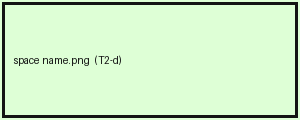
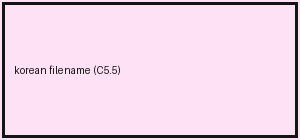
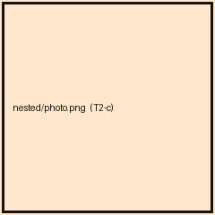

# 05 Media and attachments

Attachments must come out of the export as files, with body references rewritten to point at them. External images must not be silently dropped.

## C5.1 An attached PNG

## C5.2 An attached JPEG

## C5.3 An attached SVG

## C5.4 An attachment whose filename contains a space

## C5.5 An attachment with a non-ASCII filename

## C5.6 An external image by URL

## C5.7 An image with an explicit width

## C5.8 An image wrapped in a link

## C5.9 An image inside a table cell

| Caption | Image |
| --- | --- |
| in a cell |  |

## C5.10 An image inside a list item

- An item with a picture.

## C5.11 A non-image attachment linked from the body

Download [the sample file](https://winm2m.atlassian.net/wiki/download/attachments/851969/sample.txt?version=4&modificationDate=1789518387848&cacheVersion=1&api=v2).

## C5.12 The same attachment used twice

 