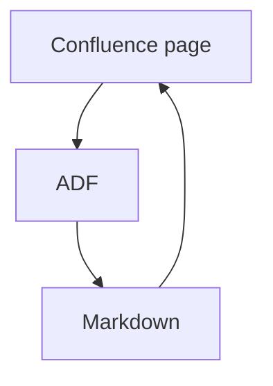
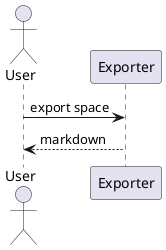
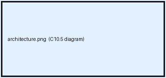

# 10 Embeds and diagrams

Diagrams and embedded markup are where "degrade, never delete" is easiest to
get wrong, because the thing that is lost is a picture rather than a sentence.

## C10.1 Mermaid

Mermaid is drawn by GitHub, GitLab and most static site generators — but only
when the fence declares the language. Drop it and a diagram becomes a text dump.

## C10.2 PlantUML

No common renderer draws PlantUML, so preserving the source is the whole job.

## C10.3 HTML macro

An HTML macro exists to emit markup. Keeping the characters but losing the
markup keeps the letter of the rule and breaks its spirit.

<!-- confluence-macro: html -->

<b>html macro body</b>

## C10.4 Raw markup in the page body

**raw markup body**

## C10.5 A diagram macro whose picture is an attachment

draw.io and Gliffy store the rendered picture as an attachment and keep only
its name in the macro. An exporter that copies the attachment but never
references it has shipped the bytes and lost the diagram.

## C10.6 Smart link to an external site

See [the conformance suite](https://github.com/YoungjuneKwon/confluence-markdown-conformance).
